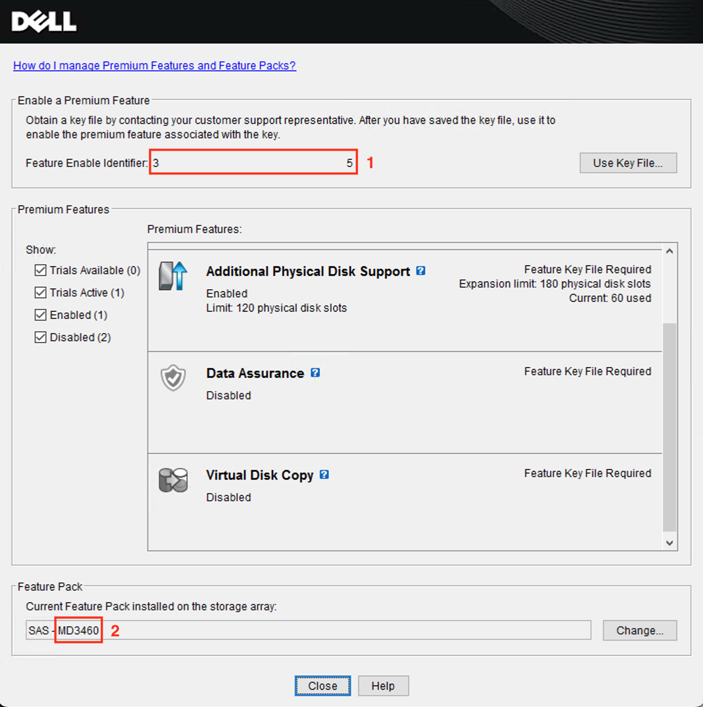

# PowerVault Key

A proof of research key generator for Dell PowerVault premium features written in go.

Based on the research done by [ReverseAllTheThings](https://github.com/ReverseAllTheThings/PowervaultKeygen).

## Usage

Since this is written in go, it can simply run it on any operating system with go installed.

```sh
$ cd src
$ go run .
```

### Parameters

To generate a licence key, at least two parameters will need to be supplied: array type, and feature enable identifier.

| Flag | Description | Required |
|------------|-------------|----------|
| `-a <array>` | The type of storage array the key should be generated for<sup>2</sup>.<br/>Must be a [supported array](#supported-arrays). | Yes |
| `-f <identifier>` | The feature enable identifier for the array<sup>1</sup>. | Yes |
| `-o <path>` | The location to save the file, if not specified the licence will be saved as `<identifier>.key` in the directory the key generator is running from. | No |



#### Full example

```sh
$ go run . -a md3460 -f 30000000000000000000000000000005 -o /home/me/licence.key
```

## Array types

### Supported arrays

The following arrays are supported:

| Array | Enabled features |
|-------|------------------|
| MD3200<br/>MD3220 | &bull; Additional hard drives - 192 drives<br/>&bull; High performance tier<br/>&bull; Snapshots<br/>&bull; Snapshots plus virtual disk copy<br/>&bull; SSD cache<br/>&bull; Virtual disk copy |
| MD3460 | &bull; Additional hard drives - 180 drives<br/>&bull; Data assurance<br/>&bull; Snapshots<br/>&bull; Virtual disk copy |

### Tested arrays

This key generator has successfully been tested on the following arrays:

- MD3200
- MD3460


